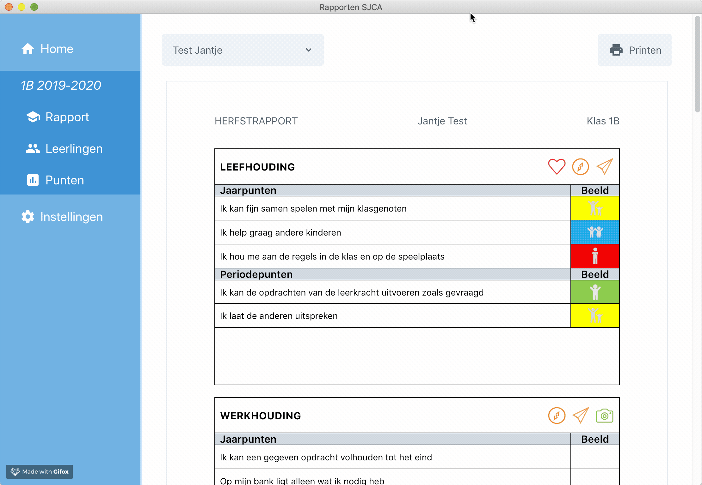
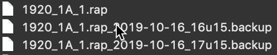

# Handleiding Rapporten SJCA

## Algemeen

De rapportenapp is bedoeld om **per schooljaar, leerjaar en periode** een rapport op te stellen voor een gegeven klas. De applicatie moet geïnstalleerd worden op een computer met Windows.

## Downloaden en installatie

Download de 1.0 versie van de applicatie via [deze link](https://github.com/Ragura/reportcards/releases/download/v1.0.0/rapporten-setup-1.0.0.exe).

Dubbelklik op het gedownloade bestand om de installatie te starten. Het zou kunnen dat je zowel bij het downloaden als het installeren **toestemming moet geven** om het bestand te vertrouwen.

Voorbeelden:

- bij het downloaden via Chrome kiezen voor "behouden" na het downloaden
- bij het installeren kiezen voor "meer informatie" en dan "toch uitvoeren"

## De applicatie starten

Bij het opstarten van de applicatie kom je terecht op het hoofdscherm "Home". Hier kan je rechtstreeks een nieuw rapport maken of een bestaand rapport openen. Indien er een nieuwe versie van de applicatie beschikbaar is zal je daarvan een melding krijgen op dit scherm, waarna op de achtergrond de update gedownload wordt. Wanneer de update klaar is om te installeren krijg je ook hiervan een melding.

## Nieuw rapport maken

Bij het aanmaken van een nieuw rapport hoor je de volgende zaken in te geven:

- Schooljaar (automatisch het huidige, maar kan worden veranderd)
- Leerjaar
- Klas
- Periode (herfst, winter, lente, zomer)

De combinatie van de verschillende keuzes bepaalt de **vorm en inhoud** van het rapport. Kijk dus na het maken van het rapport eerst even na of je wel degelijk het juiste rapport te zien krijgt.

Elk rapport wordt opgeslagen als **apart .rap bestand** en kan worden **doorgegeven aan anderen** (of jezelf op een andere PC) die de applicatie ook geïnstalleerd hebben. Standaard worden de rapporten opgeslagen in de **map documenten** met een specifieke naam (bv. 1920_1A_1.rap).

Een rapport bestaat uit drie onderdelen: **Rapport**, **Leerlingen** en **Punten**.

## Rapport

Het onderdeel **Rapport** verschijnt automatisch na het aanmaken van een nieuw rapport of het openen van een bestaand rapport. Het is de **visuele weergave** van het rapport zoals het zal worden afgedrukt / omgezet naar PDF. Je kan er dus op rekenen dat de inhoud overeenkomt met de uiteindelijke afdruk. Selecteer de actieve leerling uit de uitklapbare lijst.

Op het rapport kan je twee dingen rechtstreeks wijzigen: kleuren en commentaren. Elk geëvalueerd onderdeel dat een uiteindelijke kleur krijgt toegewezen kan veranderd worden door met de muis **overheen het kleurvak** te bewegen. Commentaren kunnen worden getypt in de daarvoor voorziene blokken.

**Elke wijziging wordt automatisch opgeslagen!**

## Leerlingen

Het onderdeel **Leerlingen** geeft een overzicht van de leerlingen die tot de klas behoren. Een nieuw rapport bevat geen leerlingen, maar deze kunnen worden toegevoegd door:

- Manueel in te voeren (voornaam & familienaam)
- Importeren vanuit bestaand rapport (bv. vorige periode)
- Importeren vanuit een Wisa Excel bestand (langs secretariaat).

Als je een leerling verwijdert, verwijder je ook de bijhorende punten en commentaren.

## Punten

Het onderdeel Punten biedt je de mogelijkheid per onderdeel en per leerling punten, kleuren of codes in te voeren. Hiervoor worden standaard 6 evaluaties voorzien per leerling. Je hoeft ze echter niet allemaal in te vullen! Gebruik alleen de evaluaties die je echt nodig hebt.

Elke invoer draagt bij tot het berekenen van een **gemiddelde** per leerling. Dit gemiddelde verschijnt automatisch op het rapport. Je krijgt ook voor jezelf een klasgemiddelde en totaal gemiddelde te zien per onderdeel, maar deze worden nergens op het rapport getoond.

Elke evaluatie staat op een aantal punten. Standaard is dit op 10 punten, maar dit kan worden aangepast via de rij met **maxima** onderaan een puntentabel. De gemiddeldes worden automatisch aangepast. Een hoger maximum weegt zwaarder door op het leerlingengemiddelde.

Bij onderdeel waarop via kleuren of codes wordt geëvalueerd **telt alleen de laatste kolom** (gemiddelde). De kleuren bij individuele evaluaties zijn alleen voor jou bedoeld als hulpmiddel om een overzicht bij te houden en een goed eindoordeel te kunnen vellen.

**Elke wijziging wordt automatisch opgeslagen!**

## PDF Maken

Bij de weergave van het rapport kan je via de knop **Printen** een PDF bestand genereren. Let op: het maken van een PDF kan even duren. Wacht het proces geduldig af vooraleer het programma af te sluiten.

Verschiet niet van de grootte van het PDF-bestand. Het is normaal dat ze om en bij de 4-5MB groot zijn. Als je ze dus opent om via een PDF-lezer te bekijken kan het zijn dat het inladen van de inhoud eventjes duurt. Ook dit is normaal.

De marges van de PDF staan standaard correct ingesteld, maar kunnen in geval van noodzaak via de instellingen veranderd worden.

## Backups maken

Omdat de applicatie niet officieel ondertekend is als vertrouwde applicatie, is ze niet altijd beste vriendjes met de anti-virus software op je computer. Dit kan in sommige gevallen leiden tot **gegevensverlies**!

Maak daarom telkens **voor** je de applicatie sluit een **backup** van je rapport (het .rap bestand). Dit kan eenvoudig langs het **instellingen** menu.

## Backups terugzetten

De applicatie heeft nog niet de mogelijkheid om automatisch een backup terug te plaatsen. Maar geen nood, dit is een eenvoudig handmatig proces!

Ga naar de map in Verkenner waar je rapporten staan. Als het goed is staan er ook een aantal `.backup` bestanden tussen de reeks. Dit zijn de backups die je genomen hebt in het verleden. Om een backup terug te zetten doe het volgende:

1. Sluit het programma als het nog openstaat (belangrijk!)
2. Verwijder het huidige rapport langs verkenner (bv. 1920_1A_1.rap)
3. Verander de naam van een backup bestand door de suffix te verwijderen. Met andere woorden, enkel de naam van het originele rapport mag overblijven (bv. 1920_1A_1.rap).

## Rapporten doorsturen

Om een rapport door te sturen naar het secretariaat of een collega is het voldoende het .rap bestand door te sturen. Dit bestand bevat alle tekst, leerlingen, punten, ... van het rapport. Op dezelfde manier kan je dit bestand ook kopiëren naar een USB stick om bijvoorbeeld op een andere PC verder te werken aan je rapport.
